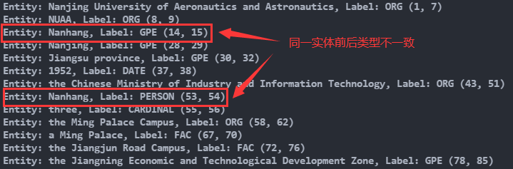

# 使用spacy实现命名实体识别
<div align="center">
      
</div>

- 上图展示的是spacy使用 __管道__ 机制处理文本：输入一段自然语言文本 __Text__，经过管道 __nlp__ 内各种 __组件__ 一步步地加工，得到Doc对象，Doc对象自然包括了各个组件加工的结果，包括词性、依存关系、词形词根和实体等。

## 安装(以spacy3.1为例，如果之前已经安装过，这步可跳过)

1. `pip install spacy==3.1.1`
2. [下载模型](https://github.com/explosion/spacy-models/releases/tag/en_core_web_md-3.1.0) `.whl/.tar.gz`文件均可

   ⭐注意这里存在一些[版本匹配和命名规则](https://github.com/explosion/spacy-models)的内容，建议自行阅读
3. 安装下载好的模型
   
   `pip install your/download/path/en_core_web_md-3.1.0.tar.gz`
4. 验证是否安装成功
   
   ```python
    >>> import spacy
    >>> nlp = spacy.load("en_core_web_md")
    >>> doc = nlp("Today is Monday.")
    >>> doc
    Today is Monday.
   ```

## 运行
1. 克隆该仓库
   ```bash
   git clone https://github.com/Rvlis/NER.git
   cd NER
   ```
2. 使用预训练语言模型进行实体识别
    
    `python test.py -m lr`


3. 结合基于规则的方式进行实体识别

    `python test.py -m rule`

## 说明
1. 使用预训练模型进行实体识别时，观察结果，存在几个问题：
   
   1. 同一实体识别前后类型不一致
   
   <div align="center">
        
   </div>

   2. 可能没有识别到想要的实体，如输入内容中的 __Double First Class Discipline University__（双一流学科大学）

1. 解决：手动添加规则
   
    1. 类型不一致: [精确字符串匹配并指定类型标签](https://spacy.io/usage/rule-based-matching#entityruler) [源码45行](test.py)
   
        `{"label":"ORG", "pattern":"Nanhang"}`

    2. 未识别出的实体，[基于词性的正则匹配](https://spacy.io/usage/rule-based-matching#entityruler)，以 __Double First Class Discipline University__ 为例

        - 首先获得目标实体的词性
            
            `python .\test.py -p "an elite Double First Class Discipline University"`

            <div align="center">
                
            </div>
            
        - 依据获得的词性制订匹配规则，[源码49~51行](./test.py)
            
            `{"label":"TITLE", "pattern":[{"POS":"PROPN"}, {"POS":"PROPN"}, {"POS":"PROPN"}, {"POS":"PROPN"}, {"POS":"PROPN"}]}`

        - 以上两步只是简陋地介绍了基于词性匹配特定实体的方法，实际当大量特定实体出现时这些规则还要经过总结、凝练，参考你们之前尝试复现的新加坡的那片论文

    3. 结合规则后的实体识别效果

        <div align="center">
            
        </div>

## 相关链接
- [spacy标注规范：包括pos、tag标签，可识别实体类型](https://spacy.io/api/annotation)
- [spacy对各种标注的描述](https://github.com/explosion/spaCy/blob/master/spacy/glossary.py)
- [spacy Matcher类](https://spacy.io/api/matcher)
- [spacy EntityRuler类：实际上基于Matcher类，所以二者匹配模板的写法基本通用](https://spacy.io/usage/rule-based-matching#entityruler)

## 阅后删😎
1. 抱歉忘了这事了😅，其实我觉得这次没啥好说的，基于规则的方式你们第一次就做过了，然后spacy作为一种易用性很高的工具，几行代码就能使用它的实体识别功能了😂
2. 我觉得我最后贴出的几条链接还是很有用的，可能这几篇提供的信息不是最多的，但它们解决的问题是最重要的，所以选择保存了下来
3. 这次的任务能把代码跑通基本就ok了我觉得，代码写得比较潦草，选择的例句也不够典型，很多地方总结的不够到位，有什么问题提出来随时交流，大家相互学习。😁
   
   